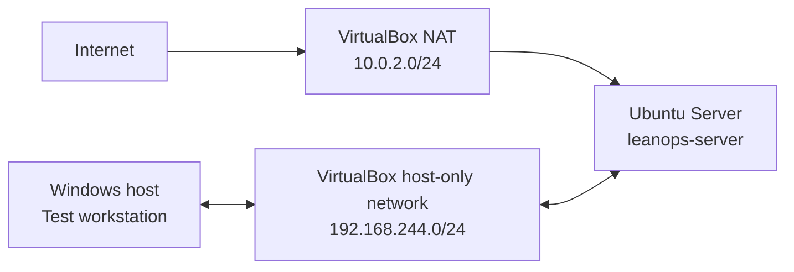

# LeanOps Lab: Improving a Small-Business Network with PDCA

LeanOps Lab is a hands-on learning project that applies PDCA and practical Lean methods to a small virtual network. The lab simulates a poorly documented small-business environment, establishes its current condition, makes one controlled improvement at a time, and verifies each result.

This is a self-directed lab project. It does not represent professional employment in networking, cybersecurity, or system administration.

## Current status

PDCA Cycle 01 is complete. A temporary Apache HTTP service was introduced to simulate an undocumented legacy service. External scans confirmed that it opened TCP port 80. Apache was then stopped and disabled. Repeated tests and a reboot confirmed that required SSH access on TCP port 22 still worked while TCP port 80 remained closed.

## Lab topology

- Adapter 1 uses VirtualBox NAT for controlled outbound updates.
- Adapter 2 uses a host-only network for isolated administration and scanning.
- No router port forwarding or public exposure is configured.
- Proton VPN must be disconnected during current lab tests because it blocks the host-only connection in the observed configuration.

## Repository contents

- [`docs/scope.md`](docs/scope.md): fictional business scenario, boundaries, and safety rules
- [`docs/asset-inventory.md`](docs/asset-inventory.md): current hardware, operating-system, storage, and network inventory
- [`docs/service-inventory.md`](docs/service-inventory.md): internal and externally observed services
- [`docs/pdca/PDCA-01-apache-service-reduction.md`](docs/pdca/PDCA-01-apache-service-reduction.md): complete Plan, Do, Check, Act record
- [`docs/runbooks/verify-host-only-connectivity.md`](docs/runbooks/verify-host-only-connectivity.md): standardized connectivity verification
- [`docs/change-log.md`](docs/change-log.md): chronological record of controlled changes
- [`docs/security-considerations.md`](docs/security-considerations.md): isolation, evidence-sanitization, and remaining risks

## Tools used

- Windows host computer
- Oracle VirtualBox 7.2.2
- Ubuntu Server 26.04 LTS
- OpenSSH
- Apache HTTP Server
- Nmap 7.99 and Npcap 1.87
- PowerShell
- Linux command-line tools including `systemctl`, `ss`, `ip`, `lsblk`, and `free`

## Evidence policy

Public evidence will be sanitized before it is added. Passwords, authentication material, real home-network information, personal usernames, unique system identifiers, and unnecessary MAC addresses will not be published.

## Next improvement

The next cycle has not been selected. Possible candidates will be evaluated against a real observed need rather than added only to make the lab larger.
