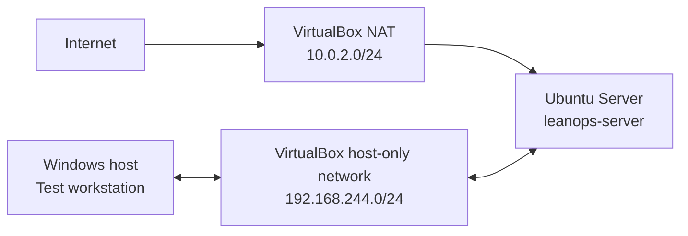

# LeanOps Lab: Improving a Small-Business Network with PDCA

LeanOps Lab is a hands-on learning project that applies PDCA and practical Lean methods to a small virtual network. The lab simulates a poorly documented small-business environment, establishes its current condition, makes one controlled improvement at a time, and verifies each result.

This is a self-directed lab project. It does not represent professional employment in networking, cybersecurity, or system administration.

## Current status

**Status: Active development, 5 PDCA cycles completed**

Cycle 05 established a protected, allowlist-based configuration backup and verified it through checksum validation, isolated restoration, metadata comparison, off-VM transfer, and reboot testing.

## Verified outcomes

| Cycle | Problem | Improvement | Verified result |
|---|---|---|---|
| 01 | Unnecessary HTTP service | Stopped and disabled Apache | Port 80 closed; SSH retained after reboot |
| 02 | Administration address could change | Assigned a static host-only address | Address, SSH, routing, DNS, and NAT persisted |
| 03 | SSH allowed password authentication | Established key authentication and disabled SSH passwords | Key access persisted; password-only access was rejected; port baseline retained |
| 04 | No active host firewall | Enabled UFW with default-deny inbound policy and source-restricted SSH | Approved SSH persisted; 999 other common TCP ports changed from closed to filtered |
| 05 | Recovery depended on VM snapshots | Created a protected, portable configuration backup process | Seven approved files restored byte-for-byte with matching metadata; Ubuntu and Windows checksum tests passed |

## Skills demonstrated

- Linux administration
- TCP/IP and service validation
- Nmap and PowerShell testing
- SSH administration
- SSH key-based authentication
- UFW host firewall administration
- Bash backup scripting
- SHA-256 integrity verification
- Isolated configuration restoration
- Backup scope and permission control
- VirtualBox networking
- Controlled change management
- Troubleshooting documentation
- PDCA and standardized work

## Lab topology

- Adapter 1 uses VirtualBox NAT for controlled outbound updates.
- Adapter 2 uses a host-only network for isolated administration and scanning.
- No router port forwarding or public exposure is configured.
- Proton VPN must be disconnected during current lab tests because it blocks the host-only connection in the observed configuration.

## Repository contents

- [`docs/scope.md`](docs/scope.md): fictional business scenario, boundaries, and safety rules
- [`docs/asset-inventory.md`](docs/asset-inventory.md): current hardware, operating-system, storage, and network inventory
- [`docs/service-inventory.md`](docs/service-inventory.md): internal and externally observed services
- [`docs/pdca/PDCA-01-apache-service-reduction.md`](docs/pdca/PDCA-01-apache-service-reduction.md): complete Plan, Do, Check, Act record
- [`docs/pdca/PDCA-02-static-host-only-address.md`](docs/pdca/PDCA-02-static-host-only-address.md): static-address improvement and verification record
- [`docs/pdca/PDCA-03-ssh-key-authentication.md`](docs/pdca/PDCA-03-ssh-key-authentication.md): key-authentication and SSH-hardening record
- [`docs/pdca/PDCA-04-ufw-host-firewall.md`](docs/pdca/PDCA-04-ufw-host-firewall.md): host-firewall configuration and verification record
- [`docs/pdca/PDCA-05-configuration-backup.md`](docs/pdca/PDCA-05-configuration-backup.md): protected configuration-backup and isolated-restore record
- [`docs/runbooks/verify-host-only-connectivity.md`](docs/runbooks/verify-host-only-connectivity.md): standardized connectivity verification
- [`docs/runbooks/configure-static-host-only-address.md`](docs/runbooks/configure-static-host-only-address.md): repeatable static-address configuration and recovery procedure
- [`docs/runbooks/configure-ssh-key-authentication.md`](docs/runbooks/configure-ssh-key-authentication.md): safe key setup, hardening, verification, and recovery procedure
- [`docs/runbooks/configure-ufw-host-firewall.md`](docs/runbooks/configure-ufw-host-firewall.md): source-restricted firewall setup, testing, and recovery procedure
- [`docs/runbooks/backup-and-restore-configuration.md`](docs/runbooks/backup-and-restore-configuration.md): repeatable backup, integrity verification, isolated restore, and controlled live recovery procedure
- [`docs/change-log.md`](docs/change-log.md): chronological record of controlled changes
- [`docs/security-considerations.md`](docs/security-considerations.md): isolation, evidence-sanitization, and remaining risks

## Tools used

- Windows host computer
- Oracle VirtualBox 7.2.2
- Ubuntu Server 26.04 LTS
- OpenSSH
- Apache HTTP Server
- Nmap 7.99 and Npcap 1.87
- PowerShell
- Linux command-line tools including `systemctl`, `ss`, `ip`, `tar`, `sha256sum`, `stat`, `cmp`, `mktemp`, `lsblk`, and `free`

## Evidence policy

Public evidence will be sanitized before it is added. Passwords, authentication material, real home-network information, personal usernames, unique system identifiers, and unnecessary MAC addresses will not be published.

## Next improvement

Cycle 06 will build a repeatable health-check script for SSH, UFW, addressing, DNS, disk, memory, and update state. Snapshot `11-PDCA05-ConfigBackupVerified` is the current recovery point.
