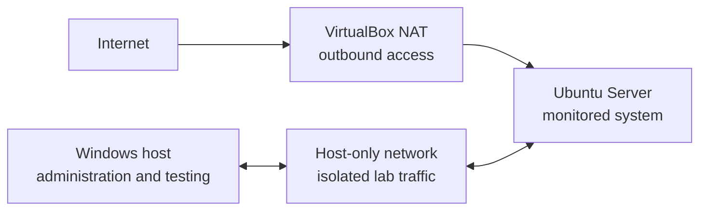
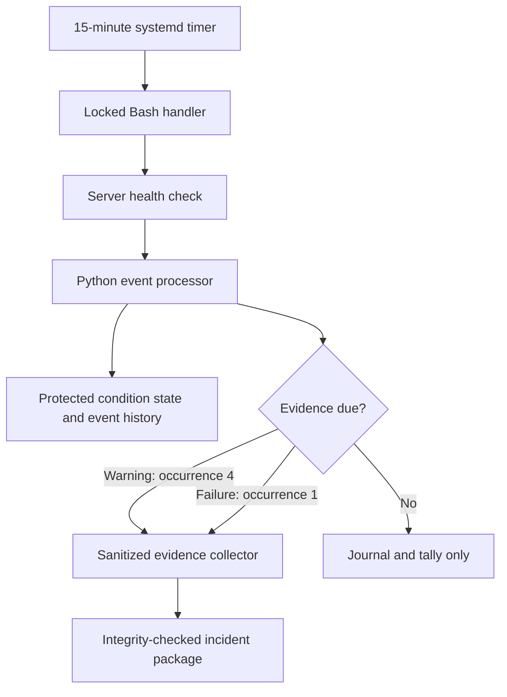

# LeanOps-Lab

LeanOps-Lab is a hands-on virtual network project that applies PDCA and practical Lean methods to Linux administration, networking, security, monitoring, incident response, and technical documentation.

The lab begins with a small, poorly documented environment. Each cycle identifies one problem, makes a controlled change, verifies the result, preserves rollback, and updates the standard. This is a self-directed learning project and is not presented as professional IT employment.

## Current status

**Active development: 11 PDCA cycles completed**

The current system uses a hardened 15-minute systemd timer, a root-controlled health check, durable condition state, warning and failure thresholds, automatic evidence collection, recovery records, a protected 15-source configuration backup, and 180-day operational-record retention. Cycle 11 reorganized the project so the architecture, control logic, verification history, and standard work can be understood quickly without changing the verified server state.

## Start here

| If you want to understand... | Start with |
|---|---|
| What the system is and how its parts connect | [Architecture and control flow](docs/architecture.md) |
| What changed in each improvement cycle | [Verified outcomes](#verified-outcomes) |
| How PDCA was applied | [PDCA records](docs/pdca/) |
| How routine work and recovery are performed | [Operational runbooks](docs/runbooks/) |
| What was changed and which snapshots preserve recovery points | [Change and snapshot log](docs/change-log.md) |
| How public evidence is protected | [Security considerations](docs/security-considerations.md) |

## Why LeanOps?

LeanOps-Lab applies manufacturing improvement principles to IT operations:

| Lean principle | Application in the lab |
|---|---|
| Make abnormal conditions visible | Health results distinguish pass, warning, failure, and monitoring-pipeline errors |
| Build quality into the process | Scripts reject unknown conditions, invalid results, unsafe paths, and mismatched state |
| Standardize successful work | Verified procedures become runbooks and current-state documentation |
| Use evidence instead of assumptions | Each change includes before-and-after checks and sanitized proof |
| Reduce repeated effort and noise | Scheduling, stable condition identities, thresholds, and duplicate suppression automate routine work without hiding problems |
| Preserve recovery | Backups, isolated restores, rollback steps, and snapshots are verified before a change becomes standard |

## Architecture at a glance

### Lab topology

- NAT provides controlled outbound updates without public exposure or port forwarding.
- The host-only network carries administration, validation, and approved scanning.
- The Windows host provides an independent test point and off-VM backup copy.

### Health-monitor workflow

| Result | Exit code | Recorded behavior |
|---|---:|---|
| Healthy | 0 | Remains in the system journal; generic healthy runs are not duplicated in the event log |
| Warning | 1 | Every occurrence is tallied; evidence is collected on the fourth consecutive occurrence |
| Failure | 2 | Recorded and evidence is collected immediately |
| Monitoring-pipeline error | 3 | Service failure remains visible and requires investigation |
| Recovery | Health result returns to normal | One recovery event is recorded; count and evidence latch reset |

See [Architecture and control flow](docs/architecture.md) for component responsibilities, data protection, retention, and recovery boundaries.

## Verified outcomes

| Cycle | Problem | Improvement | Verified result |
|---|---|---|---|
| 01 | Unnecessary HTTP service | Stopped and disabled Apache | Port 80 closed; SSH retained after reboot |
| 02 | Administration address could change | Assigned a static host-only address | Address, SSH, routing, DNS, and NAT persisted |
| 03 | SSH allowed password authentication | Established key authentication and disabled SSH passwords | Key access persisted; password-only access was rejected; port baseline retained |
| 04 | No active host firewall | Enabled UFW with default-deny inbound policy and source-restricted SSH | Approved SSH persisted; 999 other common TCP ports changed from closed to filtered |
| 05 | Recovery depended on VM snapshots | Created a protected, portable configuration backup process | Seven approved files restored byte-for-byte with matching metadata; Ubuntu and Windows checksum tests passed |
| 06 | Server health required separate manual checks | Created a root-controlled health-check script | Normal, warning, controlled-failure, and rollback behavior passed |
| 07 | Incident evidence required manual collection | Created a sanitized, integrity-checked evidence collector | Healthy and failure packages verified; failure state was preserved before rollback |
| 08 | Controls had not been tested through a complete network incident | Ran a controlled missing-default-route response drill | Failure was preserved, cause isolated, recovery staged, and reboot persistence verified |
| 09 | Health checks depended on manual execution | Added a hardened oneshot service and persistent 15-minute timer | Automated execution, journal records, rollback, recovery, and reboot persistence passed |
| 10 | Repeated abnormal results lacked durable state and bounded retention | Added condition counts, recovery records, evidence thresholds, and 180-day retention | Threshold collection, duplicate suppression, protected records, 15-source restoration, and retention passed |
| 11 | The mature lab was difficult to understand quickly | Added architecture documentation, visual control flow, role-based navigation, and a recruiter-facing project summary | Links, Mermaid syntax, terminology, cycle counts, current-state claims, and identifier sanitization were audited |

## Repository map

| Area | Contents |
|---|---|
| [Architecture](docs/architecture.md) | Current topology, health-monitor flow, components, data, retention, and recovery boundaries |
| [Project scope](docs/scope.md) | Fictional scenario, boundaries, safety rules, and accuracy statement |
| [Asset inventory](docs/asset-inventory.md) | Hardware, operating system, storage, and network inventory |
| [Service inventory](docs/service-inventory.md) | Required services and externally observed exposure |
| [PDCA records](docs/pdca/) | Eleven Plan, Do, Check, Act records with risks, tests, evidence, and adopted standards |
| [Runbooks](docs/runbooks/) | Repeatable configuration, verification, monitoring, evidence, response, backup, and recovery procedures |
| [Change and snapshot log](docs/change-log.md) | Chronological changes, verification, rollback, and recovery checkpoints |
| [Security considerations](docs/security-considerations.md) | Isolation, access control, sanitization, remaining risks, and data protection |
| [Sanitized evidence](evidence/sanitized/) | Compact public excerpts that exclude credentials and unnecessary identifiers |

## Skills demonstrated

- **Networking:** IPv4 addressing, routing, DNS, NAT, host-only networking, Nmap, and independent endpoint validation
- **Linux administration:** OpenSSH, systemd, UFW, journal review, file permissions, services, and timers
- **Automation:** Bash validation and orchestration, Python state processing, exit-code contracts, locking, and atomic writes
- **Security and recovery:** Key-only SSH, source-restricted firewall rules, evidence sanitization, SHA-256 integrity, protected backups, and isolated restoration
- **Operations:** Health checks, abnormal-condition tracking, thresholds, incident evidence, retention, controlled failure testing, and staged recovery
- **Continuous improvement:** PDCA, standardized work, rollback planning, before-and-after verification, and concise technical documentation

## Evidence policy

Public evidence is sanitized before publication. Passwords, private keys, tokens, authentication material, personal usernames, real home-network details, fingerprints, machine identifiers, and unnecessary MAC or IP addresses are excluded. Raw operational records remain protected inside the lab and expire under the documented 180-day policy.

## Tools used

Windows 11, Oracle VirtualBox, Ubuntu Server, OpenSSH, Apache, UFW, Nmap, PowerShell, Bash, Python, systemd, Git, and GitHub.

## Next improvement

Cycle 12 can add a controlled notification path to the completed local monitoring pipeline. It should define which conditions warrant notification, who receives them, how repeated notifications are suppressed, how delivery failure remains visible, and how the entire path is tested and rolled back. Snapshot `21-PDCA10-HealthEventProcessingComplete` remains the current server recovery point because Cycle 11 changed documentation only.
