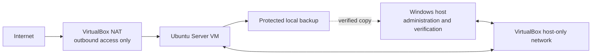
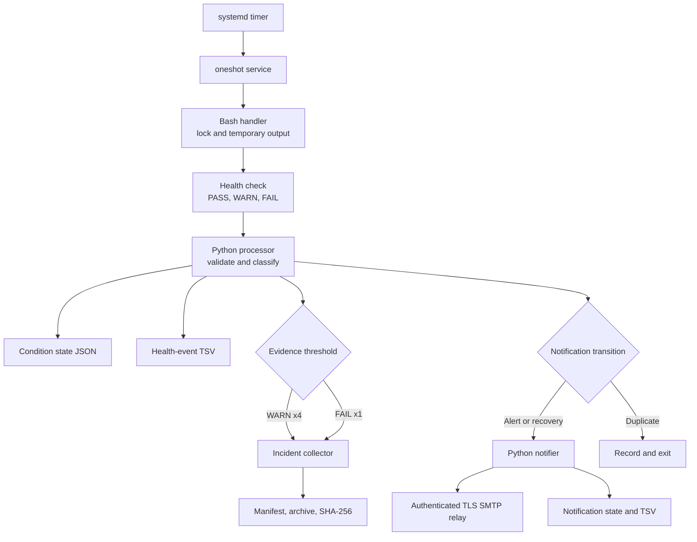
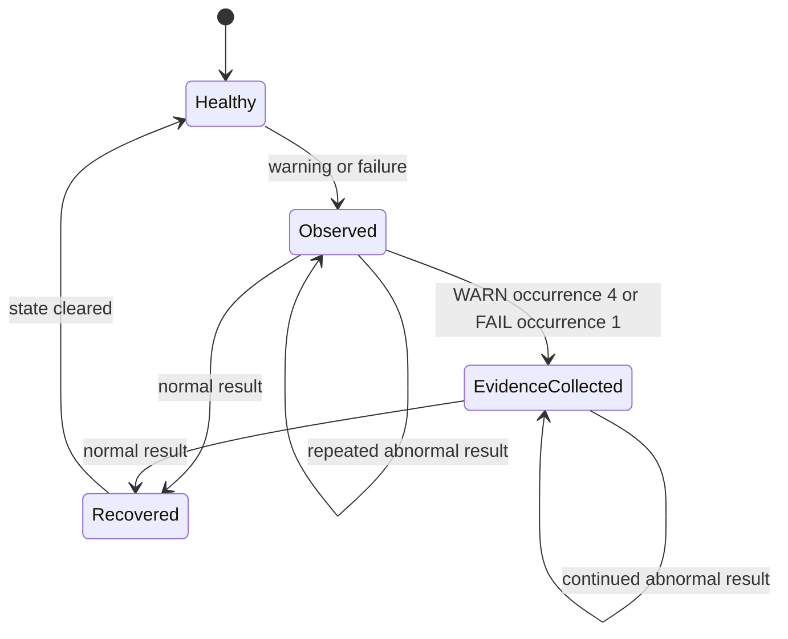

# Architecture and Control Flow

## Purpose

This document provides the current-state view of LeanOps-Lab after Cycle 12. It explains how the isolated network, security controls, scheduled monitoring, event processing, evidence collection, controlled notification, retention, backup, and recovery controls fit together.

The architecture reflects the verified operational standard through Cycle 12. Notification delivery extends beyond the VM through an authenticated TLS SMTP relay, while condition state, evidence, retry state, and notification records remain protected locally.

## Network boundary

| Component | Responsibility | Boundary or control |
|---|---|---|
| Windows host | Administration, independent testing, off-VM verification | Connects through the isolated host-only network |
| Ubuntu Server VM | Provides the managed lab system | No router port forwarding or public service exposure |
| NAT adapter | Supplies controlled outbound update access | Not used for inbound administration |
| Host-only adapter | Supplies the approved administration path | Isolated from the physical home network |
| UFW | Enforces default-deny inbound policy | SSH is restricted to the approved administration source |
| OpenSSH | Provides remote administration | Public-key authentication only; passwords disabled |

## Monitoring and evidence flow

### Component responsibilities

| Component | Role | Failure visibility |
|---|---|---|
| `leanops-health-monitor.timer` | Starts the monitoring cycle approximately every 15 minutes | Missing or inactive timer is visible through systemd checks |
| `leanops-health-monitor.service` | Runs one health-monitor cycle | Processing code `3` remains a failed unit |
| `leanops-health-event-handler` | Enforces one-at-a-time execution and controls temporary output | Lock, dependency, or execution errors return code `3` |
| `leanops-health-check` | Tests required services, firewall, networking, resources, updates, and backup integrity | Returns `0`, `1`, or `2` for healthy, warning, or failure state |
| `leanops-health-event-processor` | Validates results, assigns stable condition IDs, updates state, records events, and decides whether evidence is due | Unknown or inconsistent input returns code `3` |
| `leanops-incident-collect` | Collects a bounded, sanitized diagnostic package | Manifest records command exit codes; package receives a checksum |
| `leanops-health-notifier` | Groups alert-worthy transitions, sends one SMTP message, records delivery, and retains failed sends for retry | Delivery failure remains pending and returns a visible pipeline error |

## Condition lifecycle

- Every warning and failure is recorded.
- Generic healthy runs remain in the system journal and are not duplicated in the health-event history.
- Warnings collect evidence at the fourth consecutive occurrence.
- Failures collect evidence immediately.
- The evidence latch prevents duplicate packages while the same condition remains active.
- Recovery writes one event, clears the active condition, and resets the latch.

## Protected data and retention

| Data | Location type | Protection | Retention |
|---|---|---|---|
| Active condition state | Root-controlled state directory | Directory `0700`; file `0600`; atomic replacement | Active operational state |
| Health-event history | Root-controlled log directory | Directory `0700`; file `0600` | Daily rotation; maximum 180 days; older rotations compressed |
| Incident packages | Root-controlled incident directory | Directory `0700`; artifacts `0600`; SHA-256 sidecar | Maximum 180 days |
| Notification state and event history | Root-controlled state and log directories | Files `0600`; atomic state replacement; no credential values recorded | Daily log rotation; maximum 180 days |
| SMTP client configuration | Root-controlled configuration file | Mode `0600`; excluded from Git and configuration backups | Active secret-bearing configuration |
| Configuration backups | Root-controlled backup directory | Allowlisted sources; archives, manifests, and checksums `0600` | Retained as controlled recovery artifacts |
| PDCA records and runbooks | Git repository | Sanitized, reviewed, and versioned | Permanent project knowledge |

## Backup and recovery boundary

The configuration backup protects seventeen approved non-secret sources, including network, SSH, firewall, health-check, evidence, handler, processor, notifier, service, timer, retention-policy, and local AppArmor policy files. The secret-bearing SMTP configuration is intentionally excluded. This is not a full-system backup.

Recovery is layered:

1. Use the relevant runbook to diagnose and reverse the specific change.
2. Verify a configuration archive checksum and restore into an isolated directory before considering live replacement.
3. Use the verified off-VM copy if the server copy is unavailable.
4. Restore the appropriate VirtualBox snapshot when configuration-level recovery is insufficient.

## Lean control model

| Lean objective | Technical control |
|---|---|
| See the abnormal condition | Explicit warning, failure, recovery, delivery, and pipeline-error states |
| Avoid reaction to one noisy signal | Four-consecutive-occurrence warning threshold |
| Never hide a defect | Every abnormal occurrence is tallied; pipeline errors fail visibly |
| Avoid repeated waste | Duplicate evidence is suppressed until recovery |
| Preserve learning | Confirmed causes, corrections, runbooks, and PDCA records remain versioned |
| Limit inventory | Raw operational records expire after 180 days |
| Standardize the improved method | Successful changes update runbooks, inventories, security notes, and the README |

## Current limitations

- SMTP notifications depend on an external relay and outbound internet access; local event and retry records preserve visibility when delivery fails.
- The Windows backup is off-VM but is not yet a separate encrypted or versioned off-site copy.
- The incident collector is bounded and sanitized for observed risks, not a universal data-loss-prevention system.
- The lab contains one managed server and one administrative workstation, not a production monitoring fleet.

These limitations define logical future PDCA work. Any next cycle should address a newly observed problem rather than extend the system without evidence of need.
